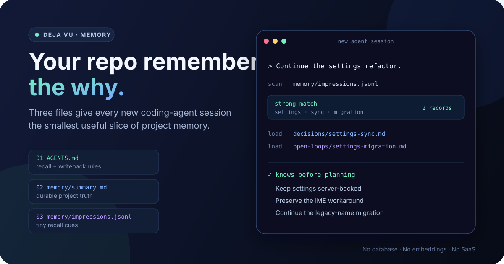
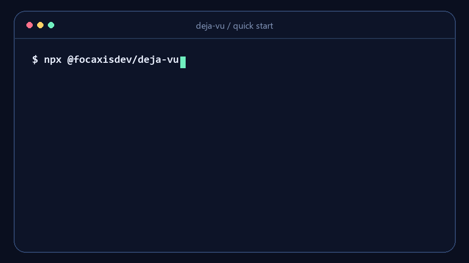

# Deja Vu — project memory for coding agents

[](https://github.com/focaxisdev/deja-vu/actions/workflows/ci.yml)
[](https://www.npmjs.com/package/@focaxisdev/deja-vu)
[](./LICENSE)
[](./package.json)

**Stop re-explaining your repo every time you open a new AI coding-agent session.**

Deja Vu is a three-file, repo-local memory system that any capable coding agent can follow. It keeps durable decisions and constraints beside the code, then loads only the smallest useful slice for the current task.

No database. No vector store. No embeddings. No SaaS. No daemon. No required npm install.



## Start in 60 seconds

In a fresh repo, run:

```bash
npx @focaxisdev/deja-vu init
```

That creates only the three required files:

```text
AGENTS.md
memory/summary.md
memory/impressions.jsonl
```

Already have an `AGENTS.md`? Preserve it and append an idempotent, clearly marked Deja Vu rules block:

```bash
npx @focaxisdev/deja-vu init --merge-agents
```

Inspect the plan without touching files, or verify the finished setup:

```bash
npx @focaxisdev/deja-vu init --dry-run
npx @focaxisdev/deja-vu doctor
```



Then start the next agent session with:

> Follow AGENTS.md. Scan memory/impressions.jsonl before substantial work, load only the matching memory, and write back durable project context only.

Prefer a zero-package setup? Copy the [`starter-kit/`](./starter-kit) instead. npm is a convenience layer, not the product.

## What changes

| Without Deja Vu | With Deja Vu |
| --- | --- |
| “Here is the architecture again…” | The repo carries a compact project summary. |
| “We already rejected that approach because…” | Accepted decisions survive new chats. |
| “Do not break the workaround from last week…” | Strong task cues route to one to three relevant records. |
| Load a huge notes file or old transcript | Scan tiny cues first; load nothing when there is no match. |
| Memory stays trapped in one vendor | Markdown and JSONL travel with the repo. |

Deja Vu does not replay old chats. It helps a new session recognize what it needs to know before planning.

## Why three files?

### `AGENTS.md` — behavior

Tells an agent when to recall, how much to load, what to write back, and what never belongs in memory.

### `memory/summary.md` — durable context

Keeps the current objective, stable constraints, active priorities, accepted decisions, and unresolved follow-ups. It is compact project truth, not a log.

### `memory/impressions.jsonl` — routing cues

Keeps tiny, inspectable routes from task language to the right memory file:

```json
{"schema_version":1,"id":"settings-sync","scope":"project:your-repo","title":"Settings stay server-backed","keywords":["settings","sync","preferences","localstorage"],"record_path":"memory/decisions/settings-sync.md","updated":"2026-08-09","weight":0.9,"status":"active"}
```

This separation matters: rules tell the agent what to do, the summary restores broad context, and impressions prevent broad context from being loaded for every task.

## Recall flow

```text
task
  -> scan memory/impressions.jsonl
  -> none:   load nothing
  -> weak:   load memory/summary.md
  -> strong: load 1-3 linked records
  -> work
  -> write back durable memory only
```

Default recall budget:

- impression scan: always allowed
- summary: at most one file
- detailed records: one to three files
- full memory tree: only when the user explicitly asks

The goal is not to store more. The goal is to recall less, better.

## Agent compatibility

The protocol is vendor-neutral. It is a strong fit when an agent can read repo files, follow project instructions, and update files.

Short prompts are included for:

- [Codex](./starter-kit/prompts/codex.md)
- [Claude Code](./starter-kit/prompts/claude-code.md)
- [Cursor](./starter-kit/prompts/cursor.md)
- [Windsurf](./starter-kit/prompts/windsurf.md)
- [ChatGPT](./starter-kit/prompts/chatgpt.md)
- [Gemini CLI](./starter-kit/prompts/gemini-cli.md)

For chat-only tools, paste the rules and only the relevant memory files manually. Deja Vu is a protocol agents can follow; it does not claim every agent supports it automatically. See [agent compatibility](./docs/agent-compatibility.md).

## Safe by design

Tracked memory is part of the repo and may be public. Write back only context that should change future work:

- accepted decisions and architecture intent
- stable project constraints and preferences
- unresolved follow-ups
- milestone summaries
- sparse recall-quality feedback

Never store secrets, credentials, private keys, customer or user PII, full transcripts, raw logs, or disposable exploration noise.

`deja-vu doctor` validates the required setup and flags obvious secrets, transcript-like content, oversized memory, malformed JSONL, and unresolved feedback routes. It is a guardrail, not a complete secret or PII scanner.

## CLI reference

The optional CLI serves the file-first protocol:

```bash
npx @focaxisdev/deja-vu init --agents codex,claude-code
npx @focaxisdev/deja-vu init --merge-agents
npx @focaxisdev/deja-vu doctor --json
npx @focaxisdev/deja-vu explain
```

`init` creates missing files only. It never replaces existing files unless `--force` is explicitly passed. When `AGENTS.md` already exists without Deja Vu rules, the command reports that setup is incomplete; `--merge-agents` appends a marked block to unrelated rules and leaves conflicting or partial blocks for manual review.

Initialization backs up files before overwriting or appending and reports the backup directory. Check `ready` and run `doctor` before use; see [reliability and recovery](docs/reliability.md) for restoration instructions and transaction limits.

Focused tools are also available:

```bash
deja-vu-scan-memory "current task"
deja-vu-lint-memory --memory-root memory
deja-vu-feedback-report --memory-root memory
```

## Protocol and docs

Deja Vu Protocol v0.4 defines the lifecycle:

1. scan tiny cues
2. classify familiarity as none, weak, or strong
3. load the smallest useful memory
4. work normally
5. write back durable context only
6. compact or retire stale memory when recall gets noisy

Start here:

- [Starter kit](./starter-kit/README.md)
- [Demo walkthrough](./docs/demo-walkthrough.md)
- [Protocol](./docs/protocol.md)
- [Comparison with other memory approaches](./docs/comparison.md)
- [Workflow](./docs/workflow.md)
- [Markdown storage contract](./docs/storage-markdown.md)
- [Scripted recall](./docs/scripted-recall.md)
- [Architecture](./docs/architecture.md)
- [llms.txt](./llms.txt)

## Optional semantic engine

The package also contains the original TypeScript semantic recall engine for projects that outgrow manual cue routing. It adds threshold-gated recall and plugin seams for embeddings, storage, scoring, and vector search while keeping Markdown memory canonical.

```bash
npm install @focaxisdev/deja-vu
```

```ts
import { createInMemorySemanticRecallEngine } from "@focaxisdev/deja-vu";

const engine = createInMemorySemanticRecallEngine({
  thresholds: { strong: 0.6, weak: 0.45 },
});
```

Read the [engine guide](./docs/engine/semantic-engine.md) or run the [basic example](./examples/basic/index.ts). The engine is an optional acceleration layer, not the default adoption path.

## Contributing

Issues and focused pull requests are welcome. Read [CONTRIBUTING.md](./CONTRIBUTING.md) for the project boundaries and verification commands.

## Development

```bash
npm ci
npm run test:src:readonly
npm run check:links
npm run lint:memory
npm run report:feedback
npm test
```

`npm test` rebuilds `dist` and verifies package contents. Use `test:src:readonly` when you want source tests without build-output side effects.

---

If Deja Vu saves you one repo re-explanation, [star the repository](https://github.com/focaxisdev/deja-vu) so other coding-agent users can find it.
