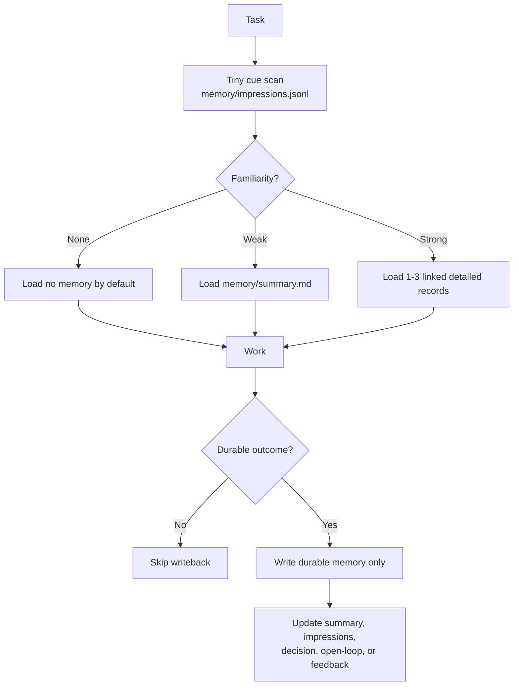

# Deja Vu Flow



ASCII fallback:

```text
Task
  |
  v
Tiny cue scan
  |
  v
No familiarity   -> load nothing
Weak familiarity -> load summary
Strong familiarity -> load 1-3 detailed records
  |
  v
Work
  |
  v
Durable writeback only
```

The point is not to replay old context. The point is to recognize when a task deserves more context.
